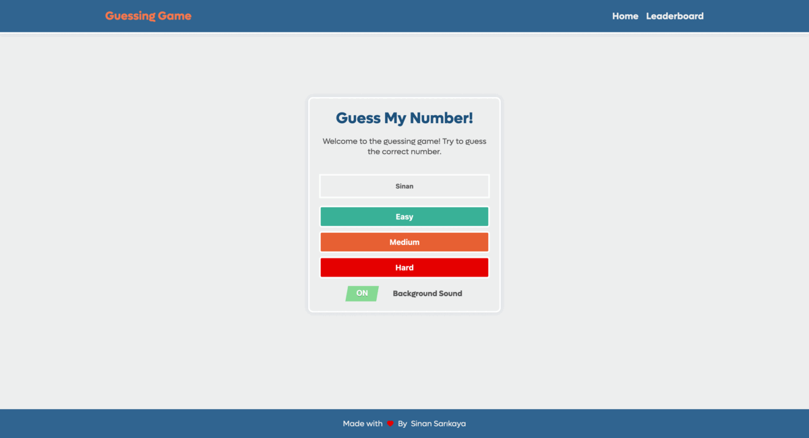

# JavaScript Guessing Game


Welcome to the JavaScript Guessing Game! Try to guess the correct number and challenge yourself. Play the game [here](https://sinansarikaya.github.io/js-guessing-game/).

## Features

- Choose the difficulty level (Easy, Medium, Hard).
- Toggle background sound on/off.
- User-friendly interface.
- Leaderboard to track top scores.
- Responsive design.

## Demo

Check out the live demo [here](https://sinansarikaya.github.io/js-guessing-game/).

## Getting Started

1. Clone the repository:

   ```bash
   git clone https://github.com/sinansarikaya/js-guessing-game.git
   ```

2. Open the `index.html` file in your browser or deploy it to a web server.

## Usage

- Enter your name and choose the difficulty level.
- Click on the numbers to make guesses.
- Use the up and down buttons for assistance.
- Enjoy the game and try to get the highest score!

## Screenshot



## Contributions

Contributions are welcome! Feel free to open an issue or submit a pull request.

## License

This project is licensed under the [MIT License](LICENSE).

## Author

Sinan Sarıkaya

Bu README.md dosyası, projenin özelliklerini, nasıl başlanacağını, kullanım talimatlarını, ekran görüntülerini, katkıda bulunma bilgilerini ve lisans bilgilerini içermektedir. Uygulamanın GitHub reposu için uygun bir açıklama sunmaktadır.
